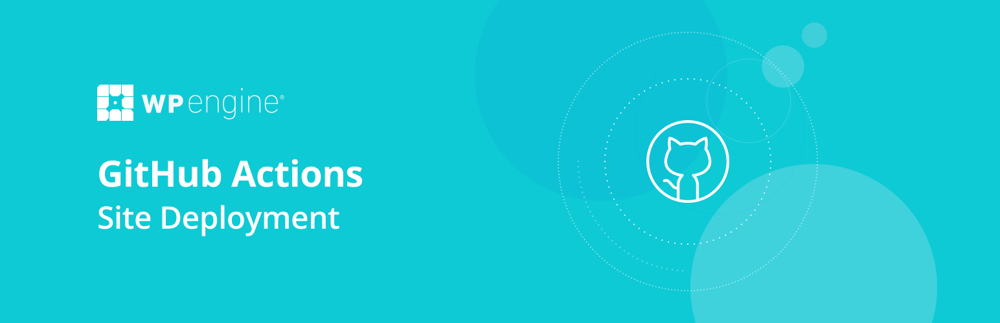

[](https://github.com/wpengine/github-action-wpe-site-deploy/actions/workflows/e2e-deploy.yml)  [](https://github.com/wpengine/github-action-wpe-site-deploy/actions/workflows/lint-files.yml)  [](https://github.com/wpengine/github-action-wpe-site-deploy/actions/workflows/release.yml)

# WP Engine GitHub Action for Site Deployment

Use this GitHub Action to deploy code from a GitHub repo to a WP Engine environment of your choosing. If you do not have a WP Engine Account, [click here to get started!](https://wpengine.com/plans/?utm_content=wpe_gha) If you do have an account, check out our guided [step-by-step instructions](https://my.wpengine.com/profile/github_action).

This action enables you to:
  * Deploy a full site directory or subdirectory of your WordPress install
  * Perform a PHP Lint
  * Customize rsync flags
  * Clear cache
  * Execute a post-deploy script of your choosing

## Setup Instructions


1. **SSH PUBLIC KEY SETUP IN WP ENGINE**
* [Generate a new SSH key pair](https://wpengine.com/support/ssh-keys-for-shell-access/#Generate_New_SSH_Key?utm_content=wpe_gha) if you have not already done so. Please note that this SSH Key needs to be *passwordless*.

* Add *SSH Public Key* to WP Engine SSH Gateway Key settings. [This Guide will show you how.](https://wpengine.com/support/ssh-gateway/#Add_SSH_Key?utm_content=wpe_gha)

2. **SSH PRIVATE KEY SETUP IN GITHUB**

* Add the *SSH Private Key* to your [Repository Secrets](https://docs.github.com/en/actions/security-guides/encrypted-secrets#creating-encrypted-secrets-for-a-repository) or your [Organization Secrets](https://docs.github.com/en/actions/security-guides/encrypted-secrets#creating-encrypted-secrets-for-an-organization). Save the new secret "Name" as `WPE_SSHG_KEY_PRIVATE`.

3. **YML SETUP**

* Create `.github/workflows/main.yml` directory and file locally.
Copy and paste the configuration from below, replacing the value under `branches:` and the value for `WPE_ENV:`.

* To deploy from another branch, simply create another yml file locally for that branch, such as `.github/workflows/stage.yml` and replace the values for `branches:` and  `WPE_ENV:` for that workflow.

This provides the ability to perform a different workflow for different branches/environments. Consult ["Environment Variable & Secrets"](#environment-variables--secrets) for more available options.

4. Git push your site GitHub repo. The action will do the rest!

View your actions progress and logs by navigating to the "Actions" tab in your repo.

## Example GitHub Action workflow

### Simple main.yml:

```yml
name: Deploy to WP Engine
on:
  push:
    branches:
     - main
jobs:
  build:
    runs-on: ubuntu-latest
    steps:
    - uses: actions/checkout@v3
    - name: GitHub Action Deploy to WP Engine
      uses: wpengine/github-action-wpe-site-deploy@v3
      with:
        WPE_SSHG_KEY_PRIVATE: ${{ secrets.WPE_SSHG_KEY_PRIVATE }}
        WPE_ENV: <your_install_name_here>
```

### Extended main.yml

```yml
name: Deploy to WP Engine
on:
  push:
    branches:
     - main
jobs:
  build:
    runs-on: ubuntu-latest
    steps:
    - uses: actions/checkout@v3
    - name: GitHub Action Deploy to WP Engine
      uses: wpengine/github-action-wpe-site-deploy@v3
      with:
      # Deploy vars
        WPE_SSHG_KEY_PRIVATE: ${{ secrets.WPE_SSHG_KEY_PRIVATE }}
        WPE_ENV: <your_install_name_here>
        # Deploy Options
        SRC_PATH: "wp-content/themes/genesis-child-theme/"
        REMOTE_PATH: "wp-content/themes/genesis-child-theme/"
        PHP_LINT: TRUE
        FLAGS: -azvr --inplace --delete --exclude=".*"  --exclude=wp-content/mu-plugins/local-plugin --exclude-from=.deployignore
        SCRIPT: "path/yourscript.sh"
        CACHE_CLEAR: TRUE
```

## Environment Variables & Secrets

### Required

| Name | Type | Usage |
|-|-|-|
| `WPE_SSHG_KEY_PRIVATE` | secrets | Private SSH Key for the SSH Gateway and deployment. See below for SSH key usage. |

### Deploy Options

| Name | Type | Usage |
|-|-|-|
| `WPE_ENV` | string | Insert the name of the WP Engine environment you want to deploy to. This also has an alias of `PRD_ENV`, `STG_ENV`, or `DEV_ENV` for multi-step workflows. |
| `SRC_PATH` | string | Optional path to specify a directory within the repo to deploy from. Ex. `"wp-content/themes/genesis-child-theme/"`. Defaults to root of repo filesystem as source. |
| `REMOTE_PATH` | string | Optional path to specify a directory destination to deploy to. Ex. `"wp-content/themes/genesis-child-theme/"` . Defaults to WordPress root directory on WP Engine.  |
| `PHP_LINT` | bool | Set to TRUE to execute a php lint on your branch pre-deployment. Default is `FALSE`. |
| `FLAGS` | string | Set optional rsync flags such as `--delete` or `--exclude-from`. The example is excluding paths specified in a `.deployignore` file in the root of the repo. This action defaults to a non-destructive deploy using the flags in the example above. <br /><br />_Caution: Setting custom rsync flags replaces the default flags provided by this action. Consider also adding the `-azvr` flags as needed.<br /> `-a` preserves symbolic links, timestamps, user permissions and ownership.<br /> `-z` is for compression <br /> `-v` is for verbose output<br /> `-r` is for recursive directory scanning_|
| `SCRIPT` | string | Remote bash file to execute post-deploy. This can include WP_CLI commands for example. Path is relative to the WP root and file executes on remote. This file can be included in your repo, or be a persistent file that lives on your server.  |
| `CACHE_CLEAR` | bool | Optionally clear page and CDN cache post deploy. This takes a few seconds. Default is TRUE. |


### Further reading

* **NOTE:** This Action DOES NOT utilize WP Engine GitPush or the GitPush SSH keys [found here.](https://wpengine.com/support/git/#Add_SSH_Key_to_User_Portal?utm_content=wpe_gha)
* **TIP:** If using a GitHub Organization, adding the SSH key to the [Organization Secrets](https://docs.github.com/en/actions/security-guides/encrypted-secrets#creating-encrypted-secrets-for-an-organization) will allow all repos to reference the same SSH key for deploys using the method in the sample `main.yml`. The SSH Key also connects to all installs made available to its WP Engine User. One key can then effectively be used to deploy all projects to their respective sites on WP Engine. Less work. More deploys!
* [Defining environment variables in GitHub Actions](https://docs.github.com/en/actions/reference/environment-variables)
* [Storing secrets in GitHub repositories](https://docs.github.com/en/actions/reference/encrypted-secrets)
* It is recommended to leverage one of [WP Engine's .gitignore templates.](https://wpengine.com/support/git/#Add_gitignore?utm_content=wpe_gha)
* This action excludes several files and directories from the deploy by default. See the [exclude.txt](https://github.com/wpengine/site-deploy/blob/main/exclude.txt) for reference.

## Versioning

We follow [SemVer](https://semver.org/) and [GitHub's action versioning recommendations](https://github.com/actions/toolkit/blob/01e1ff7bc04e1c57c980a0d1530478a5b60cf812/docs/action-versioning.md) for maintaining major, minor, and patch [version tags](https://github.com/wpengine/github-action-wpe-site-deploy/tags). Patch tags (e.g. `v1.1.1`) are created for each release and will not move once created. Major tags (e.g. `v1`) and minor tags (e.g. `v1.1`) will be updated to track their respective latest versions.

We recommend binding this action to the latest major tag so that you will receive backwards compatible updates.
